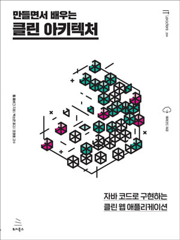

# 만들면서 배우는 클린 아키텍처
> 자바 코드로 구현하는 클린 웹 애플리케이션

{width="500" height="700"}

* 계층형 아키텍처의 문제는 무엇일까?
* 의존성 역전하기
* 코드 구성하기
* 유스케이스 구현하기
* 웹 어댑터 구현하기
* 영속성 어댑터 구현하기
* 아키텍처 요소 테스트하기
* 경계 간 매핑하기
* 애플리케이션 조립하기
* 아키텍처 경계 강제하기
* 의식적으로 지름길 사용하기
* 아키텍처 스타일 결정하기
