# 만들면서 배우는 클린 아키텍처
> 자바 코드로 구현하는 클린 웹 애플리케이션

{width="500" height="700"}

* 계층형 아키텍처의 문제는 무엇일까?
* 의존성 역전하기
* 코드 구성하기
* 유스케이스 구현하기
* 웹 어댑터 구현하기
* 영속성 어댑터 구현하기
* 아키텍처 요소 테스트하기
* 경계 간 매핑하기
* 애플리케이션 조립하기
* 아키텍처 경계 강제하기
* 의식적으로 지름길 사용하기
* 아키텍처 스타일 결정하기

## 요약

* 계층형 아키텍처
    - 웹 -> 도메인 -> 영속성. 기본적으로 많이 쓰는 아키텍처를 의미
    - 단점들은 보통 많이 얘기되는 것들이다. 기억해두면 논의할때 좋을듯
        + 나쁜 습관들이 스며들기 쉽다
            * 계층형 아키텍처는 데이터베이스 주도 설계를 유도한다
            * 육각형 아키텍처, DDD 같은 경우 도메인 주도 설계를 목표하고 있다
        + 지름길을 택하기 쉬워진다
        + 테스트하기 어려워진다
        + 유스케이스를 숨긴다
        + 동시 작업이 어려워 진다
* 클린 아키텍처
    - 정의
        + 설계가 비즈니스 규칙의 테스트를 용이하게 하고, 비즈니스 규칙은 프레임워크, 데이터베이스, UI 기술, 그 밖의 외부 애플리케이션이나 인터페이스로부터 독립적일 수 있다는 것
        + 도메인 코드가 바깥으로 향하는 어떤 의존성도 없어야 함을 의미
        + 의존성 역전 원칙에 의해 모든 의존성이 도메인 코드를 향하고 있다
    - 특징
        + 모든 의존성은 도메인 로직을 향해 안쪽으로
        + 도메인 코드에서는 어떤 영속성 프레임워크나 UI 프레임워크가 사용되는지 알 수 없다. 특정 프레임워크에 특화된 코드를 가질 수 없다
    - 대가
        + 도메인 계층이 외부 계층과 철저하게 분리돼야 하므로 애플리케이션의 엔티티에 대한 모델을 각 계층에서 유지보수해야 한다
        + 영속성 계층과 도메인 계층에 엔티티 클래스를 각각 정의
* 육각형 아키텍처. 헥사고날
    - 정의
        + 클린 아키텍처와 유사
        + 애플리케이션 코어가 각 어댑터와 상호작용하기 위해 특정 포트를 제공하는 것
    - 특징
        + 모든 의존성은 코어를 향한다
        + 애플리케이션과 상호작용하는 다양한 어댑터가 있다
            * driving adapter, driven adapter
* 4장. 유스케이스 구현하기
    - 풍부한 도메인 모델 vs 빈약한 도메인 모델
        + 풍부한 도메인 모델
            * 엔티티에서 가능한 많은 도메인 로직이 구현된다
        + 빈약한 도메인 모델
            * 엔티티가 얇다. 상태를 표현하는 필드와 이 값을 읽고 바꾸는 getter, setter 정도만 있다
* 5웹 어댑터 구현하기
    - 결국 말하는 바는 단일 컨트롤러에서 모든 API를 구현하지 말고 API마다 '컨트롤러 나누기'
* 영속성 어댑터 구현하기
    - 결국 말하는 바는 '인터페이스 나누기' + '영속성 어댑터 나누기'
* 테스트
    - 도메인 엔티티 -> 단위 테스트
        + 도메인 엔티티는 외부 의존성을 가지지 않는 POJO가 되는게 좋으므로 단위 테스트를 쉽게 작성 가능하다
    - 유스케이스 -> 단위 테스트
        + 유스케이스는 mocking + BDD 방식으로 테스트 작성
    - 어댑터 -> 통합 테스트
        + 어댑터는 의존성이 필요하므로 @SpringbootTest / in-memory / testcontainers
    - 사용자가 취할 수 있는 중요 애플리케이션 경로 -> 시스템 테스트
* 매핑 전략
    - 종류
        + 매핑하지 않기 전략
        + 양방향 매핑 전략
        + 완전 매핑 전략
            * > 보통 양방향 + 완전 매핑 전략을 섞어서 쓰는듯?
        + 단방향 매핑 전략
            * > 여기서 처음 본 패턴
    - 가이드라인 예시
        + 변경 유스케이스를 작업하고 있다면
            * 웹 계층 <-> 애플리케이션 계층 : 계층간 결합을 제거하기 위해 '완전 매핑 전략'
            * 애플리케이션 계층 <-> 영속성 계층 : 매핑 오버헤드 줄이기 '매핑하지 않기'
        + 쿼리 작업을 하고 있다면
            * 매핑 오버헤드 줄이기. 빠른 코드 작성. '매핑하지 않기' 1번
            * 하지만 애플리케이션 계층에서 영속성 문제나 웹 문제를 다뤄야 한다면 각각 '양방향 매핑' 전략으로 바꾸기
* 아키텍처 경계 강제하기
    - 아키텍처, 패키지 구조를 테스트하는 방법 `com.tngtech.archunit`
* 의도적으로 지름길 선택하기
    - 지름길을 먼저 취하고 나중에 고치는 것이 더 실용적, 경제적일 수 있다. 의도적인 지름길에 대해서는 세심하게 잘 기록하는게 필요
    - > [DOCUMENTING ARCHITECTURE DECISIONS](https://www.cognitect.com/blog/2011/11/15/documenting-architecture-decisions) 문서 작성을 이런식으로 연습하는 것도 도움이 될 듯
    - 지름길
        + 서로 다른 유스케이스 간 모델 공유하기
        + 도메인 엔티티를 입출력 모델로 사용하기
        + 인커밍 포트 건너뛰기
        + 애플리케이션 서비스 건너뛰기
* 아키텍처 스타일 결정하기
    - 도메인 주도 개발을 해야한다
    - 계층형도 좋다. 다만 아키텍처 스타일에 대해서 괜찮은 결정을 내리는 유일한 방법은 다른 아키텍처 스타일을 경험해보는 것이다
        + > 내가 이 책을 읽기 시작한 이유. 많은 인사이트를 주었다. Good

> 배울점들

* adapter에 web controller, JPA repository 같은게 있다
* port in/out 해당 계층에서 사용하는 DTO 그리고 의존성 역전을 위한 인터페이스
* JPA Entity와 Domain Entity를 따로 두었다
    - 이를 위해서 Mapper도 따로 두는 형태다
* java를 오랜만에 써서...final, static, of 팩토리 메서드 등을 적절하게 잘 사용하고 있다
    - 불변이 필요한 경우 final
* primitive type을 거의 사용하지 않는다. Id 같은 것들도 nested class로 따로 선언해서 사용한다
* Bean Validation API도 잘 쓰면 좋을듯. `jakarta.validation.*`
    - 필드에 지정된 Bean Validation 애너테이션을 검증하고, 유효성 검증 규칙을 위반한 경우 예외 던짐
    - 입력 모델에 있는 유효성 검증 코드를 통해 유스케이스 구현체 주의에 사실상 오류 방지 계층(anti corruption layer)를 만들었다
        + anti corruption layer: 하나의 바운디드 컨텍스트를 다른 바운디드 컨텍스트와 격리시키는 계층
* `PersistenceAdapter`, `UseCase`, `WebAdapter` 같은 어노테이션을 따로 만들어서 사용

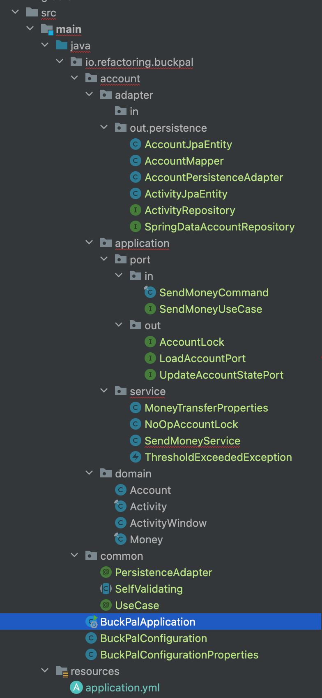{width="350" height="750"}

## 1장. 계층형 아키텍처의 문제는 무엇일까?

* 계층형 아키텍처란?
    - 웹 -> 도메인 -> 영속성
    - 계층형 아키텍처는 견고한 아키텍처 패턴이다. 잘 이해하고 사용한다면 영속성 계층에 독립적으로 도메인 로직을 작성할 수 있다
    - 문제점
        + 나쁜 습관들이 스며들기 쉽다
            * 계층형 아키텍처는 데이터베이스 주도 설계를 유도한다
            * 보통 계층형 아키텍처에서는 영속성 계층을 먼저 개발한다. 이는 의존성의 방향에 따라 자연스럽게 구현한 것이다.
            * 하지만 비즈니스 관점에서는 도메인 로직을 먼저 만들어야 한다.
            * 가장 큰 원인은 ORM 프레임워크, JPA, 하이버네이트
            * 영속성 계층과 도메인 계층의 결합
            * 서비스는 영속성 모델을 비즈니스 모델처럼 사용하게 된다
                - 이는 데이터베이스와 관련된 속성들 지연로딩,트랜잭션,캐시 flush 등의 작업과 엮이게 된다
        + 지름길을 택하기 쉬워진다
            * 상위 계층에 위치한 컴포넌트에 접근해야하는 경우? 컴포넌트를 한단계 내리면 된다. 한번이 어려운것
            * 영속성 계층으로 하나 둘 내리다보면 비대해진다
        + 테스트하기 어려워진다
            * 만약 웹 계층에서 간단하게 영속성 계층의 필드를 조작하면? 도메인 계층을 건너뛰게된다
            * 이러면 웹 계층을 테스트하기 위해서 영속성 계층도 모킹해야한다.
        + 유스케이스를 숨긴다
            * 계층형 아키텍처에서는 도메인 로직이 여러 계층에 걸쳐 흩어지기 쉽다
            * 서비스의 너비가 넓어진다.
        + 동시 작업이 어려워 진다

## 2장. 의존성 역전하기

* 단일 책임 원칙
    - 책임이란 '오로지 한 가지 일만 하는 것'
    - 컴포넌트를 변경하는 이유는 오직 하나뿐이어야 한다
* 부수효과에 관한 이야기
* 의존성 역전 원칙
    - 계층형 아키텍처에서는 의존성은 항상 아래 방향
    - 상위 계층들이 하위 계층들에 비해 변경할 이유가 더 많다
    - 도메인 계층 -> 영속성 계층. 의존하고 있기 때문에, 영속성 계층을 변경할때마다 도메인 계층을 변경해야할 수 있다
    - 이를 해결하기 위해 인터페이스를 도입한다

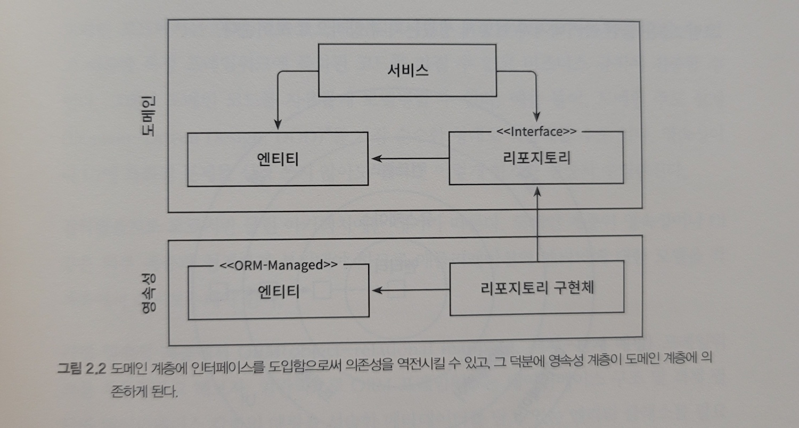{width="800" height="300"}

* 클린 아키텍처
    - 정의
        + 설계가 비즈니스 규칙의 테스트를 용이하게 하고, 비즈니스 규칙은 프레임워크, 데이터베이스, UI 기술, 그 밖의 외부 애플리케이션이나 인터페이스로부터 독립적일 수 있다는 것
        + 도메인 코드가 바깥으로 향하는 어떤 의존성도 없어야 함을 의미
        + 의존성 역전 원칙에 의해 모든 의존성이 도메인 코드를 향하고 있다
    - 특징
        + 모든 의존성은 도메인 로직을 향해 안쪽으로
        + 도메인 코드에서는 어떤 영속성 프레임워크나 UI 프레임워크가 사용되는지 알 수 없다. 특정 프레임워크에 특화된 코드를 가질 수 없다
    - 대가
        + 도메인 계층이 외부 계층과 철저하게 분리돼야 하므로 애플리케이션의 엔티티에 대한 모델을 각 계층에서 유지보수해야 한다
        + 영속성 계층과 도메인 계층에 엔티티 클래스를 각각 정의

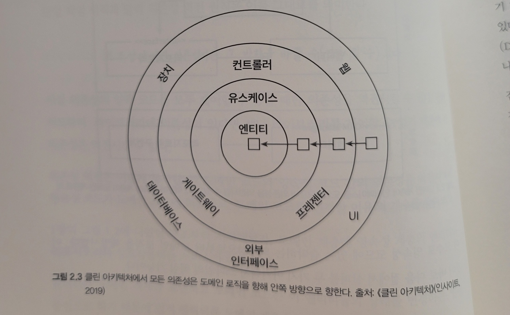{width="800" height="300"}

* 육각형 아키텍처. 헥사고날
    - 정의
        + 클린 아키텍처와 유사
        + 애플리케이션 코어가 각 어댑터와 상호작용하기 위해 특정 포트를 제공하는 것
    - 특징
        + 모든 의존성은 코어를 향한다
        + 애플리케이션과 상호작용하는 다양한 어댑터가 있다
            * driving adapter, driven adapter

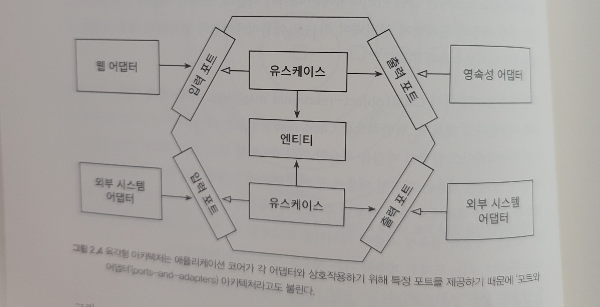{width="800" height="300"}

## 3장. 코드 구성하기

* 계층으로 구성하기
    - domain / persistence / web 패키지를 둔다
* 기능으로 구성하기
    - account 패키지 하위에 domain, persistence, web에 필요한 클래스들을 모두 모은다

둘다 아키텍처적으로 표현력이 약하다
한눈에 파악이 어려움

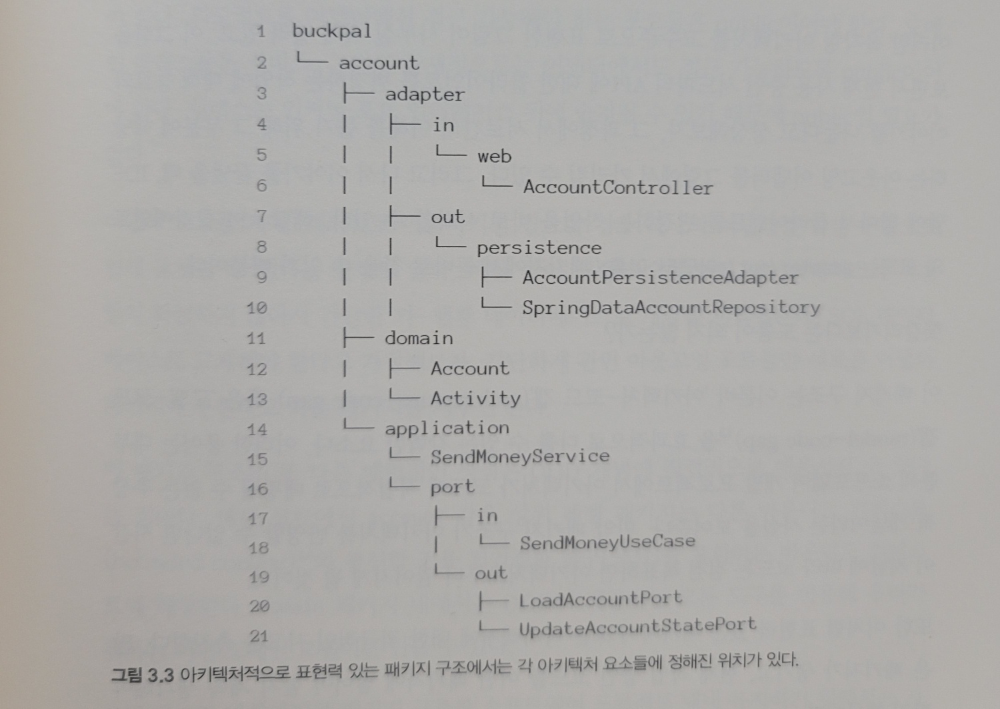{width="800" height="500"}

의존성 역전

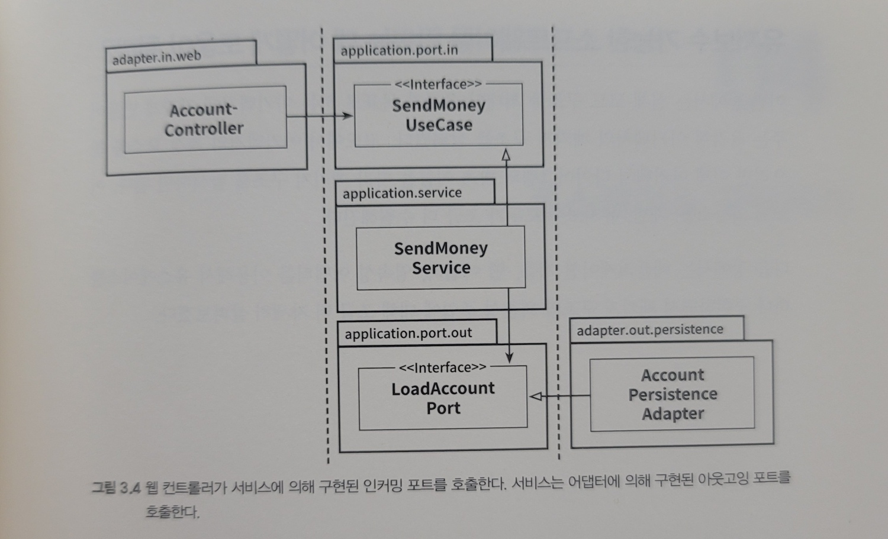{width="800" height="300"}

## 4장. 유스케이스 구현하기

1. 입력을 받는다
2. 비즈니스 규칙을 검증한다
3. 모델 상태를 조작한다
4. 출력을 반환한다

{width="350" height="750"}

> 배울점들

* adapter에 web controller, JPA repository 같은게 있다
* port in/out 해당 계층에서 사용하는 DTO 그리고 의존성 역전을 위한 인터페이스
* JPA Entity와 Domain Entity를 따로 두었다
    - 이를 위해서 Mapper도 따로 두는 형태다
* java를 오랜만에 써서...final, static, of 팩토리 메서드 등을 적절하게 잘 사용하고 있다
    - 불변이 필요한 경우 final
* primitive type을 거의 사용하지 않는다. Id 같은 것들도 nested class로 따로 선언해서 사용한다
* Bean Validation API도 잘 쓰면 좋을듯. `jakarta.validation.*`
    - 필드에 지정된 Bean Validation 애너테이션을 검증하고, 유효성 검증 규칙을 위반한 경우 예외 던짐
    - 입력 모델에 있는 유효성 검증 코드를 통해 유스케이스 구현체 주의에 사실상 오류 방지 계층(anti corruption layer)를 만들었다
        + anti corruption layer: 하나의 바운디드 컨텍스트를 다른 바운디드 컨텍스트와 격리시키는 계층
* `PersistenceAdapter`, `UseCase`, `WebAdapter` 같은 어노테이션을 따로 만들어서 사용

유스케이스의 책임

* 입력 유효성 검증
    - -> Bean Validation API
* 생성자의 힘
    - 빌더 대신 팩토리 메서드
* 유스케이스마다 다른 입력 모델
    - -> 유지보수를 위해 명확히 분리
* 비즈니스 규칙 검증하기 (로직을 어디에 둬야할까?)
    - 입력 유효성 검증? 비즈니스 규칙 검증? 무슨 차이?
        + 입력 유효성 검증이란 구문상의 (syntactical) 유효성을 검증하는 것
            * 도메인 모델의 현재 상태에 접근할 필요 없음. `@NotNull` 애너테이션을 붙이는 것처럼 선언적으로 가능
        + 비즈니스 규칙 검증은 의미적인 (semantical) 유효성 검증하는 것
            * 도메인 모델의 현재 상태에 접근해야함
* 풍부한 도메인 모델 vs 빈약한 도메인 모델
    - 이 책의 아키텍처 스타일은 도메인 모델을 구현하는 방법에 대해서는 열려 있다
        + 이는 자유롭게 적합한 방식을 선택할 수도 있지만, 어떠한 지침도 없기 때문에 저주이기도하다
    - 자주 언급되는 것은 DDD에 나오는 rich domain model, anemic domain model
    - 풍부한 도메인 모델
        + 엔티티에서 가능한 많은 도메인 로직이 구현된다
    - 빈약한 도메인 모델
        + 엔티티가 얇다. 상태를 표현하는 필드와 이 값을 읽고 바꾸는 getter, setter 정도만 있다

풍부한 도메인 모델에는 도메인 로직이 엔티티에 구현된다
빈약한 도메인 모델에서는? 유스케이스에서 구현한다
예를 들면 출금 계좌와 입금 계좌 엔티티를 로드하고, 검증하고, 출금, 입금 한 뒤 데이터베이스로 보낸다. '풍부함'이 엔티티 대신 유스케이스에 존재하는 것이다

> 하지만 여러개의 엔티티를 다뤄야할때는 어플레케이션 도메인 서비스 같은 역할이 필요한게 아닐까?

* 유스케이스마다 다른 출력 모델
    - 전체 엔티티를 리턴하지 않고, 필요한 것만 리턴하기
* 읽기 전용 유스케이스는 어떨까?
    - 읽기만 하는, 간단한 유스케이스는 어떻게 구현할까?
    - query service에 구현하는 방법
        + 인커밍 포트에서 바로 데이터베이스 로드를 위해서 아웃고잉 포트를 호출. 마치 지름길
        + CQS, CQRS 같은 개념
            * > 여기서 Command라는게 등장하는데 쓰기 가능한 유스케이스의 DTO를 Command라고 부르는 것도 관련이 있을듯

이러한 작업들은 더 많은 코드 작업을 필요로 한다. 장점이 뭘까?
* 유스케이스를 명확히 이해할 수 있고
* 장기적으로 유지보수가 쉽고
* 다른 사람이 작업 중인 유스케이스를 건드리지 않을 수 있다

## 5장. 웹 어댑터 구현하기

웹 어댑터의 책임

* HTTP 요청을 자바 객체로 매핑
* 권한 검사
* 입력 유효성 검증
* 입력을 유스케이스의 입력 모델로 매핑
* 유스케이스 호출
* 유스케이스의 출력을 HTTP로 매핑
* HTTP 응답을 반환

입력 유효성 검증...유스케이스에도 있는데?
꼭 똑같이 구현해야하는 것은 아니다.
다만 '웹 어댑터의 입력 모델을 유스케이스의 입력 모델로 변환할 수 있다는 것'을 여기서 검증해야한다 (입력, 출력)

컨트롤러 나누기

Account에 대한 모든 API를 하나의 컨트롤러에?
일단 클래스마다 코드는 적을수록 좋다

> 여기서 컨트롤러가 받는 DTO를 CreateAccountResource, UpdateAccountResource 라는 네이밍을 사용했다

단일 컨트롤러에 모두 구현하는 것은 데이터 구조의 재활용을 촉진하고, 이는 다른 API의 요구사항 때문에 지금 API에는 필요없는 필드들, 메서드들이 구현될 수도 있다는 것을 의미한다

## 6장. 영속성 어댑터 구현하기

영속성 어댑터의 책임

* 입력을 받는다
* 입력을 데이터베이스 포맷으로 매핑한다
* 입력을 데이터베이스로 보낸다
* 데이터베이스 출력을 애플리케이션 포맷으로 매핑한다
* 출력을 반환한다

영속성 계층. 어떻게 구현할까?

보통은 모든 데이터베이스 연산을 하나의 repository 인터페이스에 넣어둘것이다
이는 단 하나의 메서드만 사용하더라도 하나의 '넓은' 포트 인터페이스 전체에 대해서 의존성이 생긴다

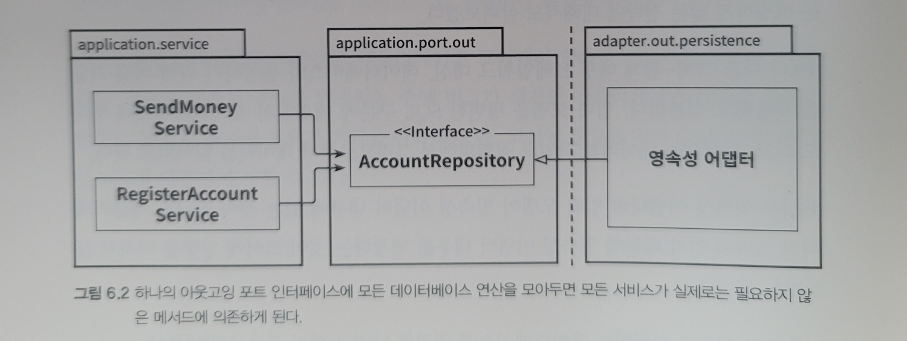{width="800" height="250"}

* ISP 인터페이스 분리 원칙을 사용하자. 인터페이스 분리
    - 매우 좁은 포트를 만드는 것은 코딩을 plug-and-play 경험으로 만든다

> 필요없는 화물을 운반하는 무언가에 의존하고 있으면 예상하지 못헀던 문제가 생길 수 있다
로버트 C. 마틴

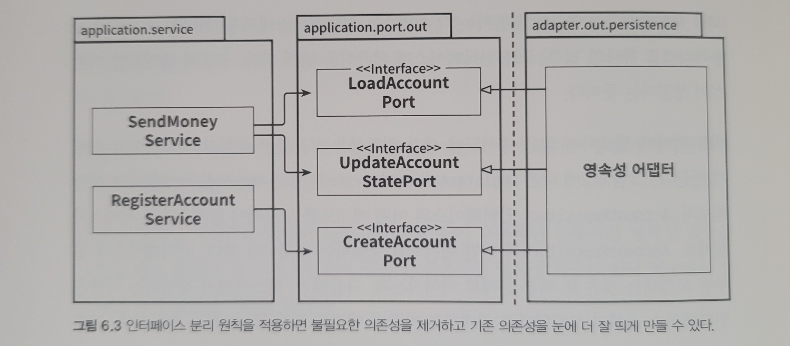{width="800" height="250"}

* 영속성 어댑터 나누기
    - 애그리거트당 하나의 영속성 어댑터 접근 방식은 나중에 여러 개의 바운디드 컨텍스트의 영속성 요구사항을 분리하기 위한 좋은 토대가 된다

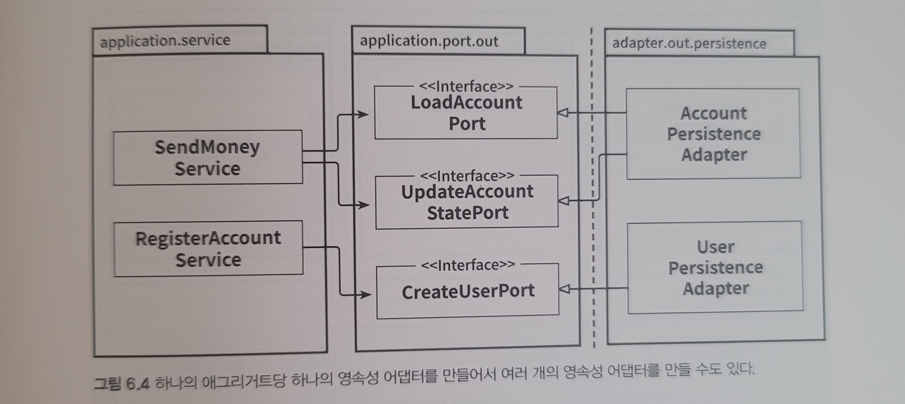{width="800" height="250"}

* 바운디드 컨텍스트까지 고려해본다면?

> 애그리커트: 불변식을 만족해서 하나의 단위로 취급될 수 있는 연관 객체의 모음
도메인 주도 설계

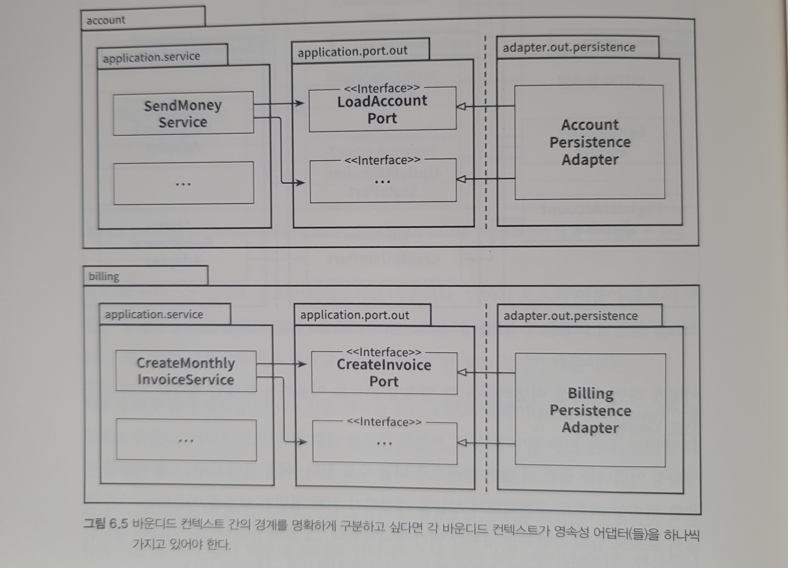{width="800" height="400"}

Account, AccountJpaEntity를 따로 두었다. 매핑 전략에 대해서는 뒤에 나온다

트랜잭션은 어떻게?
하나의 특정한 유스케이스에 대해서 전체 성공 or 전체 실패.가 되어야한다

## 7장. 아키텍처 요소 테스트하기

테스트 피라미드

* 단위 테스트
* 통합 테스트
* 시스템 테스트
* end-to-end 테스트 (+UI)

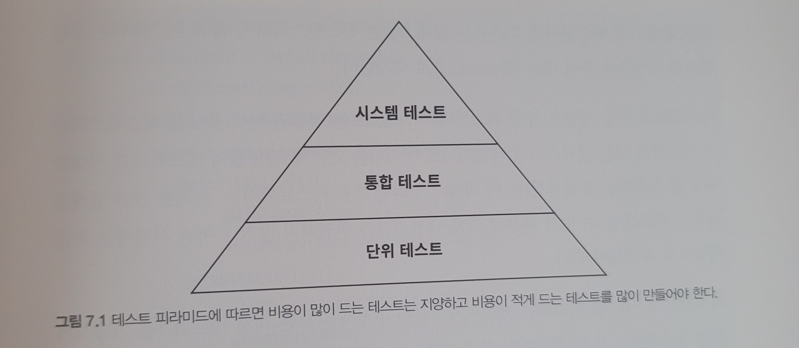{width="800" height="250"}

유스케이스 테스트 BDD, given, when, then
영속성 어댑터 테스트 testcontainers, in-memory DB

* 도메인 엔티티 -> 단위 테스트
* 유스케이스 -> 단위 테스트
* 어댑터 -> 통합 테스트
* 사용자가 취할 수 있는 중요 애플리케이션 경로 -> 시스템 테스트

> 도메인 엔티티는 외부 의존성을 가지지 않는 POJO가 되는게 좋으므로 단위 테스트를 쉽게 작성 가능하다
> 유스케이스는 mocking + BDD 방식으로 테스트 작성
> 어댑터는 의존성이 필요하므로 @SpringbootTest / in-memory / testcontainers

## 8장. 경계 간 매핑하기

> 여기서 새롭게 알게된 개념들임. 중요

* 매핑하지 않기 전략
* 양방향 매핑 전략
* 완전 매핑 전략
* 단방향 매핑 전략

언제 무엇을 써야하나?
-> 그때그때 다르다! 그리고 처음에는 '매핑하지 않기'를 쓰다가 계층 간 결합을 떼어내는 전략도 좋다

'한 전략을 전체 코드에 대한 전역 규칙으로 정의하려는 충동을 이겨내야 한다'
다만 이러기 위해서는 어떤 상황일때 어떤 전략을 사용할지 가이드라인이 있어야 할 것이다

가이드라인 예시
* 변경 유스케이스를 작업하고 있다면
    - 웹 계층 <-> 애플리케이션 계층 : 계층간 결합을 제거하기 위해 '완전 매핑 전략'
    - 애플리케이션 계층 <-> 영속성 계층 : 매핑 오버헤드 줄이기 '매핑하지 않기'
* 쿼리 작업을 하고 있다면
    - 매핑 오버헤드 줄이기. 빠른 코드 작성. '매핑하지 않기' 1번
    - 하지만 애플리케이션 계층에서 영속성 문제나 웹 문제를 다뤄야 한다면 각각 '양방향 매핑' 전략으로 바꾸기

이 같은 가이드라인이 성공적으로 적용하려면 개발자들의 머릿속에 이 가이드라인이 잘 담겨 있어야 한다
그러므로 팀 차원에서 지속적으로 논의하고 수정해야한다

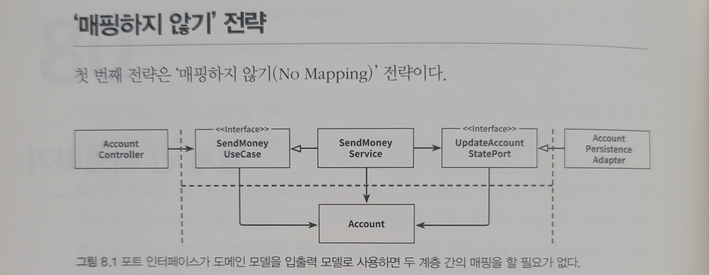{width="800" height="250"}
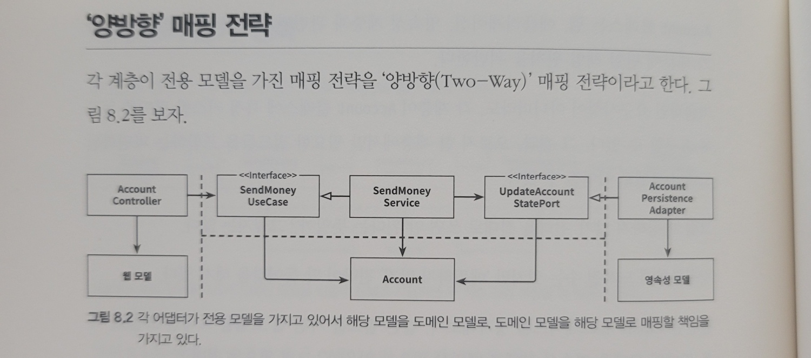{width="800" height="250"}
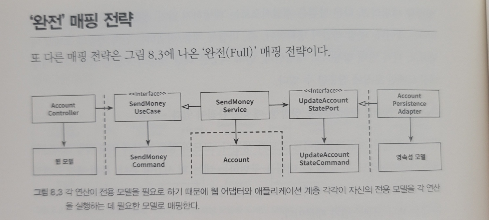{width="800" height="250"}
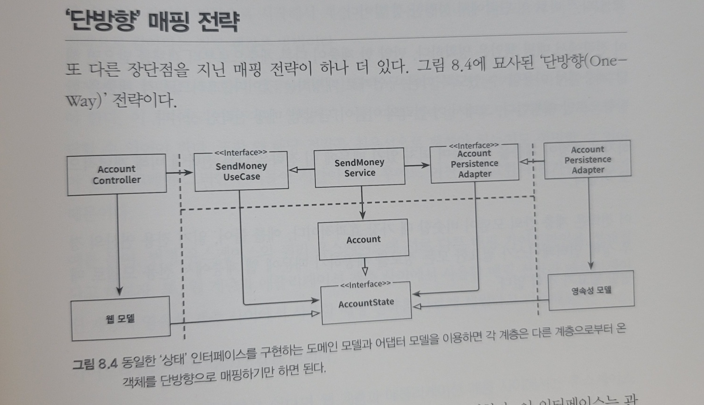{width="800" height="300"}

## 9장. 애플리케이션 조립하기

스프링에서 애플리케이션을 잘 조립해주지만..한번쯤 생각해볼만한 문제

설정 컴포넌트는 단일 책임 원칙.을 벗어나긴한다. 하지만 나머지 부분들을 깔끔하게 유지하고 싶다면 이런것이 어디에선가는 필요하다

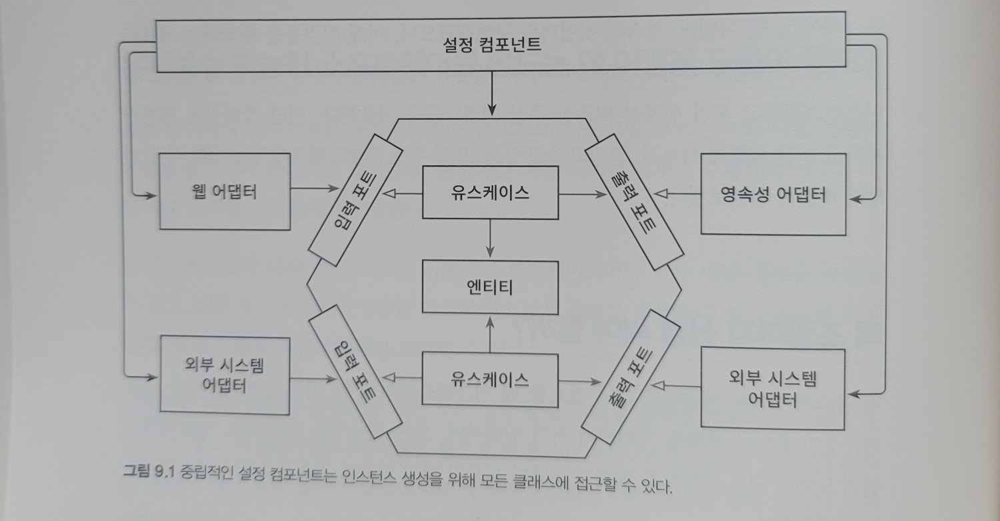{width="800" height="400"}

* 평범한 코드로 조립하기
* 스프링의 클래스패스 스캐닝으로 조립하기
* 스프링의 자바 컨피그로 조립하기

## 10장. 아키텍처 경계 강제하기

package-private(default) 접근 제한자 관련된 얘기들도 나오고, 애플리케이션을 여러개의 jar 파일로 나눠서 빌드하는 방법도 나오는데
매우 큰 애플리케이션에서는 이런 방법들도 필요하겠구나싶다

아키텍처, 패키지 구조를 테스트하는 방법도 소개된다
`com.tngtech.archunit`

## 11장. 의식적으로 지름길 사용하기

지름길을 방지하려면 먼저 지름길을 알아야한다.
우발적이 아니라 의식적으로 지름길을 선택할 수 있어야 한다

### 깨끗한 상태로 시작할 책임

지름길을 먼저 취하고 나중에 고치는 것이 더 실용적, 경제적일 수 있다
의도적인 지름길에 대해서는 세심하게 잘 기록하는게 필요

마이클 나이가드의 아키텍처 결정 기록 ADRs
> [DOCUMENTING ARCHITECTURE DECISIONS](https://www.cognitect.com/blog/2011/11/15/documenting-architecture-decisions)
문서 작성을 이런식으로 연습하는 것도 도움이 될 듯

### 지름길

* 서로 다른 유스케이스 간 모델 공유하기
* 도메인 엔티티를 입출력 모델로 사용하기
* 인커밍 포트 건너뛰기
* 애플리케이션 서비스 건너뛰기

## 12장. 아키텍처 스타일 결정하기

### 도메인이 왕이다

'외부의 영향을 받지 않고 도메인 코드를 자유롭게 발전시킬 수 있다는 것은 육각형 아키텍처 스타일이 내세우는 가장 중요한 가치다'

그리고 이것이 육각형 아키텍처 스타일이 도메인 주도 설계 방식과 정말 잘 어울리는 잉유다
도메인 중심의 아키텍처 스타일

### 경험이 여왕이다

계층형 아키텍터 스타일. 과거에 너무나 자주 해왔기에 습관이 되었다.
이것이 반드시 나쁜 결정이라는게 아니다.
지금 잘 동작하는데 바꿔야할 이유가 있을까?

다만 아키텍처 스타일에 대해서 괜찮은 결정을 내리는 유일한 방법은 다른 아키텍처 스타일을 경험해보는 것이다
> 나도 이 이유로 이 책을 읽기 시작했다. 항상 어렴풋이만 알고있었기 때문에 이번에 제대로 경험해보고자

